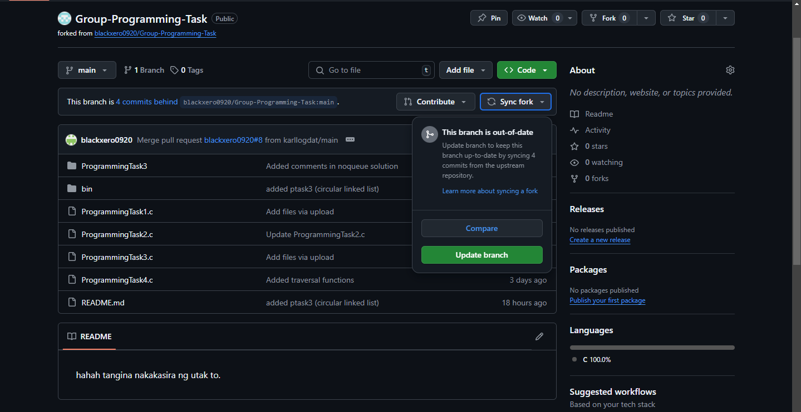

# Programming Task Repository

## Syncing repository
1. Sync Github fork to upstream.


2. Pull fork to local repository using `git pull`.

## Uploading changes to upstream
1. Add changes to the staging area (files you will commit) using `git add .` or `git add -A`.
2. Commit changes using `git commit -m "{commit message}"`. Make sure your commit messages are descriptive.
3. Push your changes to your fork using `git push`.

### TL;DR
```
git add -A
git commit -m "{commit message}"
git push
```